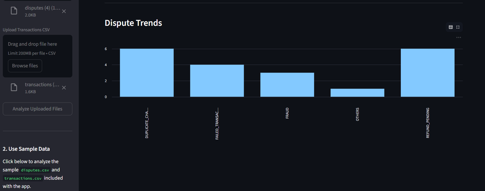
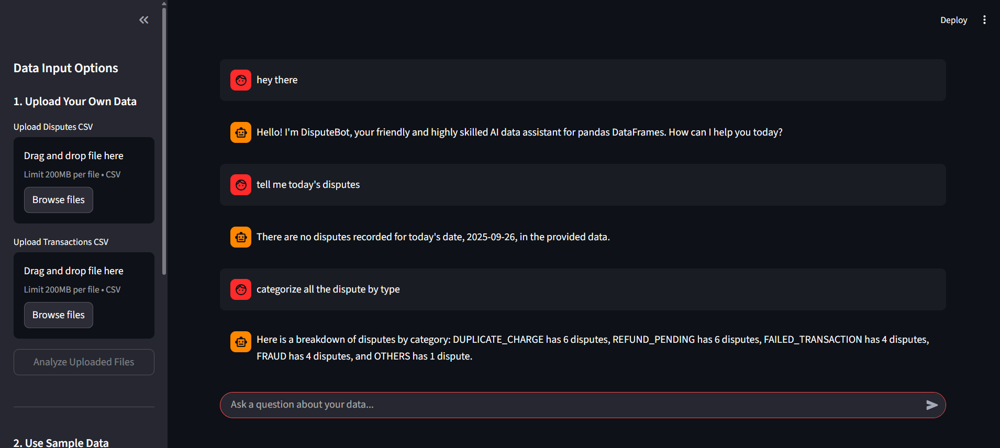

# AI-Powered Dispute Assistant

This project is a comprehensive, AI-powered web application built with Streamlit to assist in resolving customer payment disputes. It provides an end-to-end solution, from raw data ingestion to intelligent classification, resolution suggestion, and interactive, conversational data analysis.

The application leverages a hybrid AI model for dispute classification and a powerful, history-aware conversational agent (powered by Google's Gemini and LangChain) to provide a seamless user experience for support agents.




## ✨ Features

*   **Dual Data Input:** Users can either upload their own `disputes.csv` and `transactions.csv` files or instantly load a sample dataset with a single click.
*   **Hybrid AI Classification (Task 1):**
    *   Utilizes a sophisticated, rule-based waterfall logic.
    *   Combines high-confidence data-driven checks (e.g., for duplicate transactions) with advanced text analysis.
    *   Employs both fuzzy keyword matching (for lexical similarity) and semantic search with sentence-transformers embeddings (for contextual understanding).
*   **Dynamic Resolution Suggestion (Task 2):**
    *   Automatically suggests the next best action (e.g., "Auto-refund", "Manual review") based on the predicted dispute category.
    *   Provides a dynamic, data-driven justification for each suggestion.
*   **Interactive Data Dashboard:**
    *   Presents classification and resolution results in clean, interactive tables.
    *   Includes a bar chart to visualize dispute trends by category (Bonus Feature).
    *   Provides one-click downloads for the generated CSV output files.
*   **Conversational AI Chat Assistant (Task 3 & LLM Bonus):**
    *   A dedicated chat tab powered by **Google's Gemini** and **LangChain**.
    *   The agent is **history-aware**, allowing for natural, conversational follow-up questions.
    *   Users can query the processed data using natural language (e.g., "how many fraud cases need manual review?").
    *   The agent provides **streaming responses**, appearing to type in real-time for a polished user experience.

## 🏛️ Architecture

The application is built using a modular and maintainable Python package structure that separates concerns:

*   **`app.py`:** The main Streamlit entry point that acts as the "conductor," orchestrating the UI and backend logic.
*   **`dispute_assistant/` (The Core Package):**
    *   **`core.py`:** The "AI Factory." Contains the headless, powerful logic for the hybrid classification and resolution engine.
    *   **`agent.py`:** The "Agent's Brain." Configures and initializes the conversational LangChain agent with a custom prompt for personality and robustness.
    *   **`ui.py`:** The "UI Blueprint." Contains functions to build distinct Streamlit components (sidebar, results tables, chat interface), keeping the main app file clean.
    *   **`config.py`:** A centralized "Control Panel" for all settings, including keywords, thresholds, and LLM model names, allowing for easy tuning without touching the core logic.
*   **Streamlit Session State:** Used intelligently to manage the application's state, including the active UI view and the live agent object, ensuring a smooth, bug-free user experience across interactions.

## 🚀 Getting Started

Follow these instructions to set up and run the application on your local machine.

### Prerequisites

*   Python 3.9+
*   A Google AI API key for the Gemini model. You can get one from [Google AI Studio](https://aistudio.google.com/app/apikey).

### 1. Clone the Repository

```bash
git clone https://github.com/your-username/dispute_assistant.git
cd dispute_assistant
```

### 2. Set Up a Virtual Environment

It's highly recommended to use a virtual environment to manage dependencies.

```bash
# For Mac/Linux
python3 -m venv venv
source venv/bin/activate

# For Windows
python -m venv venv
.\venv\Scripts\activate
```

### 3. Install Dependencies

The project's dependencies are listed in the `requirments.txt` file.

```bash
pip install -r requirments.txt
```

### 4. Configure Your API Key

The application uses Streamlit's built-in secrets management to handle the API key securely.

1.  Create a new folder in the root of the project directory named `.streamlit`.
2.  Inside this new folder, create a file named `secrets.toml`.
3.  Open `secrets.toml` and add your Google AI API key in the following format:

    ```toml
    # .streamlit/secrets.toml
    GOOGLE_API_KEY = "YOUR_API_KEY_HERE"
    ```

### 5. Run the Application

Once the setup is complete, you can run the Streamlit application with a single command:

```bash
streamlit run app.py
```

A new tab should automatically open in your web browser with the running application.

## 📖 How to Use the App

1.  **Load Data:**
    *   **Option A (Quick Start):** Click the **"Load Sample Data"** button in the sidebar. The application will immediately process the sample CSV files located in the `/data` folder.
    *   **Option B (Custom Data):** Use the file uploaders in the sidebar to upload your own `disputes.csv` and `transactions.csv` files, then click **"Analyze Uploaded Files"**.
2.  **Review Results:**
    *   Once processing is complete, the **"Analysis & Results"** view will appear.
    *   Here you can inspect the interactive tables for classifications and resolutions.
    *   View the dispute trends in the bar chart.
    *   Change the status of a dispute by clicking on a cell in the "status" column and selecting a new value.
    *   Download the processed data as CSV files using the download buttons.
3.  **Chat with the AI:**
    *   Navigate to the **"AI Chat Assistant"** view using the selector at the top of the page.
    *   Type your questions about the data in the chat box at the bottom and press Enter.
    *   The AI will respond in real-time. Try asking follow-up questions!

    **Example Questions:**
    *   "Hello, who are you?"
    *   "How many disputes are there in total?"
    *   "List the IDs for the fraud cases."
    *   "What is the recommended action for them?"
    *   "Show me the disputes with a confidence score below 0.7."
